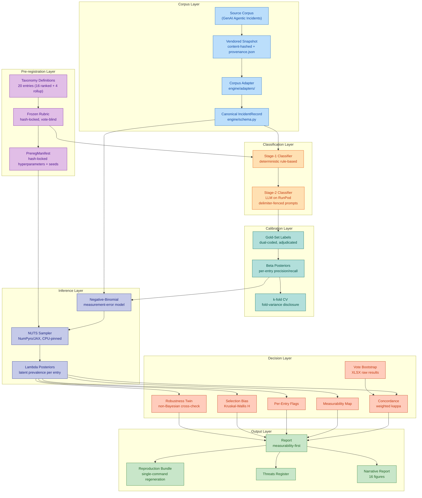
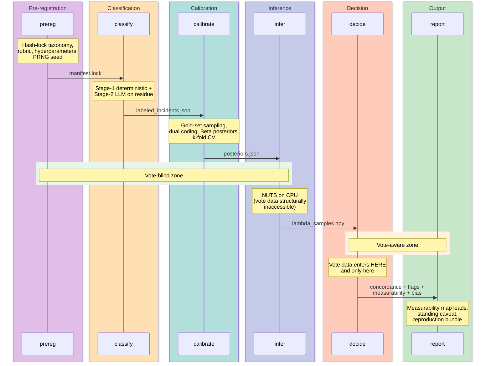
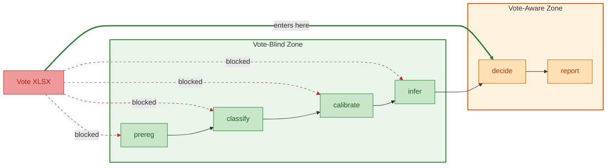

# incident-rank-validation

Engine for validating ranked security taxonomies against real-world incident
corpora. Given a community-voted "Top N" list and a corpus of labeled incidents,
the engine estimates each entry's latent prevalence via Bayesian inference and
measures how well the vote-based ranking agrees with the incident-derived
ranking.

The first production cycle targets the **OWASP Top 10 for LLM Applications
(2026)**, using 7,714 incidents from the GenAI Agentic Incidents corpus.

## 2026 OWASP LLM Cycle Results

| Metric | Value |
|---|---|
| Weighted Cohen's kappa | 0.203 \[-0.16, 0.57\] |
| Measurable entries | 17 of 20 (85%) |
| Frame-blind entries | LLM04, LLM08, LLM10 |
| Selection bias (Kruskal-Wallis) | H=0.55, p=0.46 (low) |
| Flagged entries | 5 (LLM01, LLM09, NEW-MTIE, NEW-PMP, NEW-WLA) |
| Corpus B agreement | 26% on 46 overlapping incidents |
| MCMC convergence | All R-hat < 1.001 |
| Publication status | `non_publishable=True` (single-author, INTERIM reviewers) |

The kappa of 0.203 indicates fair agreement between the community vote ranking
and the incident-data-derived ranking. Five entries show statistically notable
divergence between vote position and observed incident intensity. Three entries
(LLM04 Data/Model Poisoning, LLM08 Vector/Embedding Weaknesses, LLM10
Unbounded Consumption) are unmeasurable because the incident corpus lacks a
reference frame to estimate their recall.

## Architecture



## Pipeline Flow

The engine enforces a strict phase-gated pipeline. Each phase checks
preconditions before running and cannot access data from later phases.



## Information Firewall

Vote-rank data enters the pipeline only at the `decide` phase. The CLI
structurally prevents vote data from existing in the cycle directory during
earlier phases. This ensures the taxonomy, rubric, classification, calibration,
and inference are all vote-blind.



## Install

Requires Python 3.12.

```bash
git clone https://github.com/rocklambros/incident-rank-validation.git
cd incident-rank-validation
pip install uv
uv sync
```

For narrative report generation (matplotlib, seaborn, plotly):

```bash
uv sync --group narrative
```

Verify the install:

```bash
uv run incident-rank --help
```

## Quick Start: Synthetic Cycle

Run a synthetic end-to-end validation cycle to verify the engine works. No
external data or API keys needed.

```bash
uv run incident-rank run-synthetic \
  --cycle projects/synthetic/cycles/2026 \
  --corpus-mode synthetic
```

This runs the full pipeline (prereg, classify, calibrate, infer, decide, report)
against synthetic incident data with known ground-truth properties.

## Running a Real Cycle

A real cycle (like the OWASP LLM 2026 cycle) runs each phase individually
through the CLI:

```bash
# 1. Vendor a corpus snapshot
uv run incident-rank vendor-snapshot --project projects/owasp-llm

# 2. Freeze the rubric (after drafting + adjudication)
uv run incident-rank freeze-rubric --cycle projects/owasp-llm/cycles/2026

# 3. Classify incidents (Stage-1 + Stage-2)
uv run incident-rank classify-real --cycle projects/owasp-llm/cycles/2026

# 4. Calibrate (gold-set sampling, Beta posteriors, CV)
uv run incident-rank cal-sample --cycle projects/owasp-llm/cycles/2026
uv run incident-rank cal-calibrate --cycle projects/owasp-llm/cycles/2026
uv run incident-rank cal-cv-stability --cycle projects/owasp-llm/cycles/2026

# 5. Run NUTS inference (CPU-only, takes several hours)
uv run incident-rank infer-real --cycle projects/owasp-llm/cycles/2026

# 6. Decide (vote data enters here)
uv run incident-rank decide-real --cycle projects/owasp-llm/cycles/2026

# 7. Generate report + reproduction bundle
uv run incident-rank report --cycle projects/owasp-llm/cycles/2026
uv run incident-rank repro-bundle --cycle projects/owasp-llm/cycles/2026
```

## Project Layout

```
engine/
  adapters/       Corpus adapters (GenAI Agentic, OWASP ASI, synthetic)
  calibrate/      Gold-set sampling, Beta posteriors, k-fold CV
  classify/       Stage-1 deterministic + Stage-2 LLM classifiers
  cli/            Click CLI commands and pipeline executor
  decide/         Concordance, measurability, selection bias, twin agreement
  erratum/        Post-hoc correction lineage with Merkle audit
  model/          NUTS inference (NumPyro/JAX), robustness twin, diagnostics
  monitoring/     Optional W&B logging
  prereg/         Pre-registration: manifest, rubric, gates, attestation
  report/         Report renderer, narrative charts, diff engine
  repro/          Reproduction bundle generator
  safety/         Corpus-mode enforcement
  snapshot/       Content-hashed vendoring, drift detection
  threats/        Threats register
  vote/           Vote-data loader and bootstrap
projects/
  owasp-llm/      OWASP LLM Top 10 2026 cycle data and results
  synthetic/      Synthetic validation cycle
  synthetic-stress/ Stress-test cycle (untuned hyperparameters)
tests/
  unit/           ~80 unit tests
  integration/    End-to-end pipeline tests
  proofs/         Mathematical property tests (never-falsely-low, frame-blind gate)
  security/       Prompt injection and delimiter tests for Stage-2
notebooks/
  what_the_data_says_2026.ipynb   Interactive analysis notebook
  narrative/                      Standalone narrative report with 16 figures
docs/
  HANDOFF.md          Methodology spec (source of truth)
  PRD.md              Phase map and pickup commands
  METHODOLOGY-CHANGELOG.md   Semver-tagged methodology changes
  RUNBOOK.md          Operational runbook
  GOLDSET-CODING-GUIDE.md    Instructions for gold-set coders
  REVIEWERS.md        Reviewer identification and attestation state
```

## Key Concepts

**Measurability map.** Not every taxonomy entry can be measured. An entry is
measurable only if the incident corpus contains enough incidents *and* the
classifier can detect them. Entries where the corpus lacks a reference frame
(frame-blind) are reported as unmeasurable, not as low-prevalence. The
measurability map leads every report.

**Measurement-error model.** The engine does not treat classifier labels as
ground truth. A Negative-Binomial model with Beta-parameterized precision and
recall from gold-set calibration accounts for classifier error when estimating
each entry's latent prevalence.

**Pre-registration.** Before any inference runs, the taxonomy, rubric,
hyperparameters, and PRNG seed are hash-locked in a manifest. Post-hoc
deviations are detected automatically and disclosed in the report.

**Transparency-first publication.** Results are never suppressed. If the kappa
is low or the measurability is limited, that is reported as the finding, not
hidden. Every report carries a standing scope-and-bias caveat.

## Methodology

Full methodology is documented in [`docs/HANDOFF.md`](docs/HANDOFF.md). Phase
execution history is tracked in [`docs/PRD.md`](docs/PRD.md). Changes to the
methodology are logged with semver tags in
[`docs/METHODOLOGY-CHANGELOG.md`](docs/METHODOLOGY-CHANGELOG.md).

### Version History

| Version | Plan | Description |
|---|---|---|
| 0.1.0 | Plan 1 | Engine baseline + synthetic cycle |
| 0.2.0 | Plan 2 | GenAI Agentic corpus adapter + snapshot vendoring |
| 0.3.0 | Plan 3 | Rubric freeze workflow + attestation gates |
| 0.4.0 | Plan 4 | Gold-set calibration + Beta posteriors + k-fold CV |
| 1.0.0 | Plan 5 | First real OWASP LLM 2026 cycle (internal) |
| 1.1.0 | Plan 5 | Kappa improvement + pipeline fixes |
| 1.2.0 | Plan 6 | Corpus B corroboration + narrative report |

## Testing

```bash
# Full test suite
uv run pytest

# Type checking
uv run mypy engine tests

# Linting
uv run ruff check .

# Security scanning
uv run semgrep --config .semgrep.yml --error engine/
```

The test suite includes mathematical property tests (`tests/proofs/`) that
verify the engine never reports a truly-high-prevalence entry as low-prevalence
(the never-falsely-low guarantee), and security tests (`tests/security/`) that
verify Stage-2 LLM prompts resist injection via incident text.

## Integrity Controls

The engine enforces several structural integrity controls:

- **Hash-locked pre-registration** -- taxonomy, rubric, hyperparameters, and
  PRNG seed are frozen before inference runs.
- **Vote-blindness** -- the CLI refuses to run inference if vote data exists in
  the cycle directory.
- **Rubric attestation gate** -- classification refuses to run without a
  committed rubric attestation declaring whether the drafter saw corpus samples.
- **NUTS diagnostics gate** -- inference refuses to emit a report if R-hat >
  1.01 or if post-warmup divergences exist.
- **Snapshot binding** -- gold-set artifacts are bound to a specific corpus
  snapshot hash. Mismatches abort the run.
- **Publishability derivation** -- `non_publishable` is computed from reviewer
  attestation state, not set manually.

## License

Apache-2.0. See [`NOTICE`](NOTICE) for attribution details.

Vendored corpus data under `projects/*/cycles/*/corpora/` is distributed under
[CC-BY-4.0](https://creativecommons.org/licenses/by/4.0/).

## Links

- [Methodology spec](docs/HANDOFF.md)
- [Phase map](docs/PRD.md)
- [Methodology changelog](docs/METHODOLOGY-CHANGELOG.md)
- [Operational runbook](docs/RUNBOOK.md)
- [Security policy](SECURITY.md)
- [Contributing](CONTRIBUTING.md)
