**STATUS: NON-PUBLISHABLE** (single-author rubric, uncontrolled). This document is an internal pre-print. Before any external distribution, verify against `docs/REVIEWERS.md` PRE-PUBLISH CHECKLIST.

# Table of Contents {.unnumbered .unlisted}

1. Act 1: The Question
2. Act 2: The Corpus
3. Act 3: Classification — How We Labeled 6,600 Incidents
4. Act 4: How Good Is the Classifier?
5. Act 5: From Counts to Rankings — The Bayesian Model
6. Act 6: The Incident-Derived Rankings
7. Act 7: The Confrontation — Do Experts and Incidents Agree?
8. Act 8: Where Experts and Incidents Disagree
9. Act 9: What the Data Cannot See
10. Act 10: What This Means
11. Threats to Validity
12. Accepted Limitations
13. Reproducibility

# Act 1: The Question

The OWASP Top 10 for LLMs ranks AI security vulnerabilities. The 2025 list was built from expert surveys — hundreds of security professionals voting on what matters most. That process produced a consensus: Prompt Injection at #1, Sensitive Information Disclosure at #2, and so on down to #10.

Expert opinion is one signal. We wanted to check it against a second signal: the pattern of real-world incidents. We built a corpus of ~6,639 AI security incidents from public databases, classified each one against the 20-entry taxonomy, and asked: does the incident data agree with the experts?

This report walks through that analysis step by step. Along the way, you will see how the classification worked, how we measured its accuracy, and what a Bayesian model does with noisy measurements. Every chart and table below is computed live from the data — you can re-run any cell in the companion notebook to verify.

Here are the 20 taxonomy entries we are working with. The "Incident Rank" column is blank for now. We will fill it in Act 6, after walking through the methodology.

| Entry | Name | Incident Rank |
|-------|------|---------------|
| LLM01 | Prompt Injection | — |
| LLM02 | Sensitive Information Disclosure | — |
| LLM03 | Supply Chain Vulnerabilities | — |
| LLM04 | Data and Model Poisoning | — |
| LLM05 | Improper Output Handling | — |
| LLM06 | Excessive Agency | — |
| LLM07 | Hidden Context Exposure | — |
| LLM08 | Vector and Embedding Weaknesses | — |
| LLM09 | Misinformation | — |
| LLM10 | Unbounded Consumption | — |
| NEW-ITSCD | Inference-Time Side-Channel Disclosure | — |
| NEW-MA | Model Misalignment | — |
| NEW-MSDA | Model Scheming and Deceptive Alignment | — |
| NEW-MTIE | MCP Tool Interface Exploitation | — |
| NEW-PMP | Persistent Memory Poisoning | — |
| NEW-WLA | Weaponized LLM Abuse | — |
| ROLL-CFAS | Compositional Fine-tuning Alignment Subversion | — |
| ROLL-CMSB | Cross-Modal Safety Bypass | — |
| ROLL-LAPTF | LLM Artifact Promotion Trust Failure | — |
| ROLL-SICG | Systemic Insecure Code Generation | — |

# Act 2: The Corpus

The corpus contains 6,639 incidents from public databases: CVE, GHSA, and OSV (security advisories), plus AIAAIC (a database of AI-related harms and controversies). Each record has a text description of what happened.

The corpus splits into two strata. The **security** stratum (CVE/GHSA/OSV) contains 6,297 incidents — things like prompt-injection exploits, data leakage through APIs, and supply-chain compromises in ML packages. The **ai-harm** stratum (AIAAIC) contains 342 incidents — things like algorithmic discrimination, deepfake misuse, and surveillance overreach.

This split matters. The classifier performs differently on each stratum — security incidents have more structured descriptions (CVE format), while ai-harm incidents are written as news summaries with varying detail. We will see in Act 4 that the precision and recall calibration is dense for the security stratum and sparse-to-absent for ai-harm, and we will see in Act 5 how the Bayesian model surfaces that imbalance as wider credible intervals on the affected entries.

Stratum breakdown:

- **security**: 6,297 incidents
- **ai-harm**: 342 incidents

Total: 6,639 incidents.

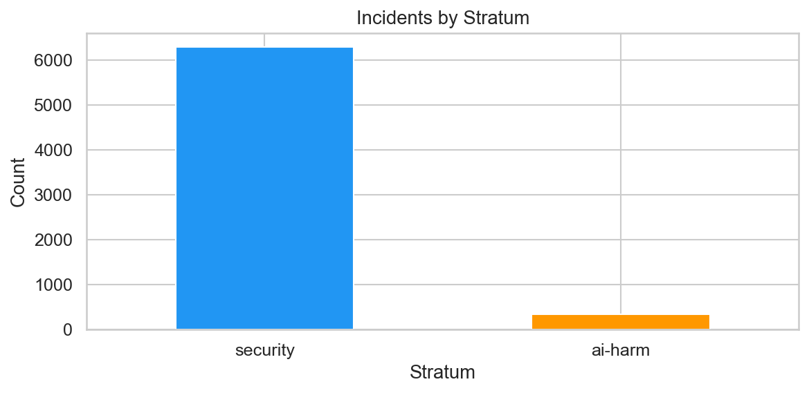

# Act 3: Classification — How We Labeled 6,600 Incidents

Each incident was classified by three different large language models: Qwen 235B, Llama 405B, and DeepSeek V3. Each model independently read the incident text and assigned it to one of the 20 taxonomy entries — or marked it "out of scope" if none fit.

When all three models agreed on the same entry, we call it **agree tier**. When two agreed and one differed, **split tier**. When all three picked different entries, **disagree tier**. The tier tells us how confident we can be in the classification. Agree-tier incidents have strong consensus. Disagree-tier incidents sit in ambiguous territory where even three independent classifiers could not converge.

In this cycle: **1,772 agree, 1,375 split, 431 disagree** (excluding out-of-scope). The agree-tier count is what feeds the Bayesian model's primary signal; split-tier incidents enter with reduced weight via the calibration step; disagree-tier incidents primarily inform the confusion boundaries we analyze in Act 9B.

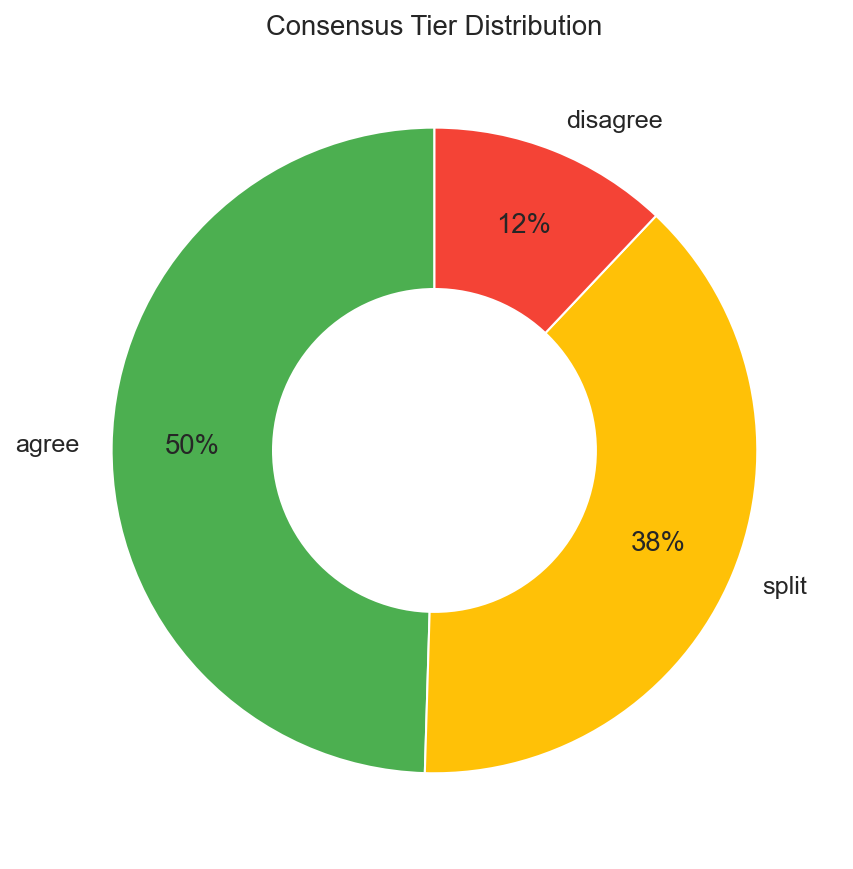

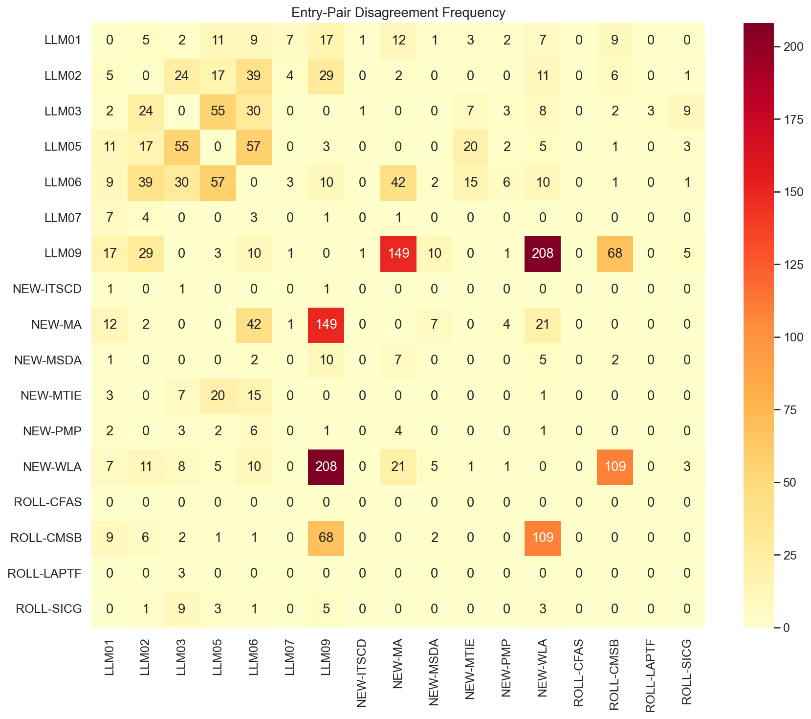

# Act 4: How Good Is the Classifier?

The classifier is a tool, not ground truth. To trust the incident counts, we need to measure how often the classifier gets it right — and how often it misses things.

**Precision**: When the classifier says "this incident belongs to LLM02," how often is it correct? We verified 323 classifications by hand to measure this, covering 16 verified entries. Each entry gets its own precision score — some entries are easier to classify than others.

**Recall**: Does the classifier find all incidents of a given type, or does it miss some? A human reviewer adjudicated 1,200 incidents across all tiers to measure this. The reviewer saw the incident text and the three model votes, then decided whether to accept the consensus, override it, or mark the incident as out of scope.

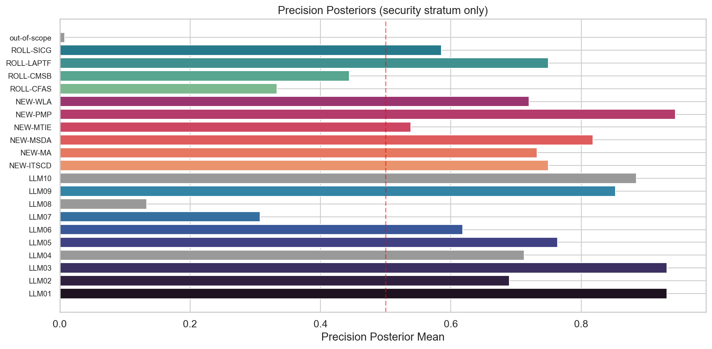

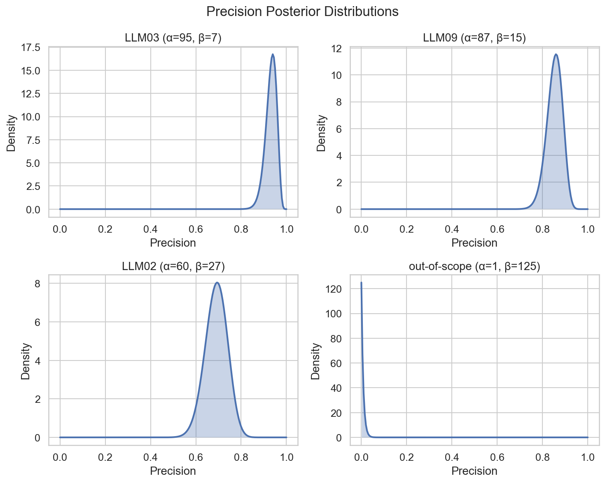

## Why precision varies so much across entries

The chart above shows precision ranging from 93% (LLM01) and 93% (LLM03) at the top down to 13% (LLM08) at the bottom. The variation is not random — it reflects how cleanly each entry's definition separates it from neighboring categories. Four entries fall **below the 50% threshold**, which deserves explanation:

- **LLM08 (Vector and Embedding Weaknesses): 13%.** This is the lowest precision in the taxonomy. Out of every 8 incidents the classifier labels as LLM08, only 1 actually is. The category describes a narrow class of attacks — adversarial manipulation of embedding spaces, vector database poisoning, retrieval-augmented generation exploits. But the classifier confuses it with LLM03 (Training Data Poisoning) and general data integrity issues. Most incidents classified here describe data manipulation that affects a model, which is conceptually adjacent but taxonomically distinct.

- **LLM07 (System Prompt Leakage): 31%.** The classifier struggles to distinguish "extracting a system prompt" (LLM07) from "overriding a system prompt" (LLM01, Prompt Injection). Both involve adversarial interaction with the prompt layer, and many real incidents involve both — an attacker extracts the system prompt *in order to* craft a better injection. The boundary is taxonomically clear but operationally blurred.

- **ROLL-CFAS (Comprehensive Framework Attacks): 33%.** Only a handful of precision observations — the posterior is dominated by the Beta(1,1) prior, so the point estimate has a wide 90% credible interval spanning from a few percent to most of the (0, 1) range. The category's broad definition ("attacks on the comprehensive AI framework") makes it a natural catch-all that absorbs incidents from adjacent entries.

- **ROLL-CMSB (Cross-Modal Safety Bypass): 44%.** This entry sits at the center of the confusion boundary described in §9B. A deepfake video that bypasses content filters could be classified as ROLL-CMSB (cross-modal bypass), LLM09 (misinformation), or NEW-WLA (weaponized abuse). The classifier picks one; a human might reasonably pick any of the three.

## What the 50% threshold means

Precision below 50% means the classifier is **wrong more often than it is right** for that entry. When you see an incident labeled "LLM08," the odds are 8:1 against it actually being a vector/embedding weakness. This has direct consequences for the Bayesian model in Act 5: low-precision entries get large upward corrections (because much of their observed count is misclassification noise from other entries) and wide credible intervals (because the correction itself is uncertain). A 13% precision estimate does not mean the entry is unimportant — it means the *automated measurement* of that entry is unreliable, and the model's uncertainty reflects that.

## Stratum coverage of precision verifications

The 323 precision verifications were drawn entirely from the security stratum (CVE/GHSA/OSV). The ai-harm stratum (AIAAIC) has **zero** direct precision measurements — the posteriors.json file contains 21 security-stratum precision keys and 0 ai-harm keys. The Bayesian model falls back to a flat Beta(1,1) = Uniform(0,1) prior for ai-harm precision, meaning it assumes no prior knowledge about classifier accuracy on those incidents (prior mean 0.5). This means error correction for ai-harm incidents relies on a weak prior, not direct measurement. We treat this as an accepted limitation (see §12) and surface it explicitly anywhere ai-harm-stratum estimates appear in the report.

# Act 5: From Counts to Rankings — The Bayesian Model

Raw incident counts would be misleading. An entry whose classifier has 30% precision looks like it has many incidents — but two-thirds of those are misclassifications wrongly attributed to it.

We need a model that adjusts the observed counts for known classifier error. Think of a bathroom scale that reads 2 pounds heavy. You would subtract 2 pounds from every reading. The Bayesian model does this for each entry separately, and it carries the uncertainty through — if the scale is 2±1 pounds off, the corrected weight is also uncertain.

## What happens with low-precision entries

For entries above 50% precision, the correction is a moderate downward adjustment — some of the observed incidents were misclassified, so the true count is lower than the raw count. The correction tightens toward the true signal.

For entries **below 50% precision**, the correction works differently. If only 13% of incidents labeled "LLM08" actually belong there, the model must infer the true rate from a signal that is mostly noise. It is like reading a bathroom scale that is off by more than half the measurement — the "correction" is larger than the reading itself. This produces two effects: (1) the corrected estimate can be very different from the raw count, and (2) the uncertainty around that estimate is wide, because small changes in the precision estimate propagate into large changes in the corrected rate.

This is why some entries in the Act 6 chart have 90% credible intervals spanning 10+ rank positions. The width is not a flaw in the model — it is the model honestly reporting how much information the data contains about each entry's true incident rate.

## The model's inputs and sampler

The model takes the observed incident counts, the measured precision and recall for each entry, and produces a **posterior distribution** over the true incident rate for each entry. A posterior distribution is not a single number — it is a range of plausible values given the data. Wide distributions mean less certainty.

We drew 16,000 samples from this distribution using the No-U-Turn Sampler (NUTS), an adaptive variant of Hamiltonian Monte Carlo. NUTS is a method for sampling from probability distributions that are too complex to compute directly. It generates a sequence of correlated draws that, after a warmup phase, represent the target distribution. Our run used 4 chains of 4,000 retained samples each, with 2,000 warmup iterations per chain, sampling pinned to CPU for cross-platform determinism.

**Convergence diagnostics.** Maximum R̂ across all parameters: 1.0001 (target < 1.01). Minimum effective sample size (ESS): 15708 (target ≥ 400 per chain). Both are well within the conventional thresholds for trusted posterior inference, so we do not report further per-chain diagnostics in this body. The full inference_summary.json artifact carries the per-entry breakdowns for any reader who wishes to inspect them.

## Handling missing data

Three entries — LLM04 (Data and Model Poisoning), LLM08 (Vector and Embedding Weaknesses), LLM10 (Unbounded Consumption) — are **frame-blind**: their incident counts come entirely from one stratum, so the model cannot cross-validate their rates across strata. These entries are included in the posterior but flagged with a ★ in the charts. Their rank estimates carry additional structural uncertainty beyond what the credible intervals capture.

**For 16 of 20 entries in the ai-harm stratum, recall has not been measured directly.** The model uses a conservative prior of approximately 1% recall — Beta(1, 101) — for those entries. This means the model assumes the classifier finds very few of those incidents and adjusts upward accordingly. These corrections are large, which is one reason the credible intervals in Act 6 are wide.

**Precision in the ai-harm stratum is also unmeasured.** The model uses a flat Beta(1,1) = Uniform(0,1) prior, meaning it treats ai-harm precision as completely unknown (prior mean 50%). This is a weaker assumption than the security stratum, where we have 5–88 hand-verified observations per entry. We surface this through §12 (Accepted Limitations) rather than burying it.

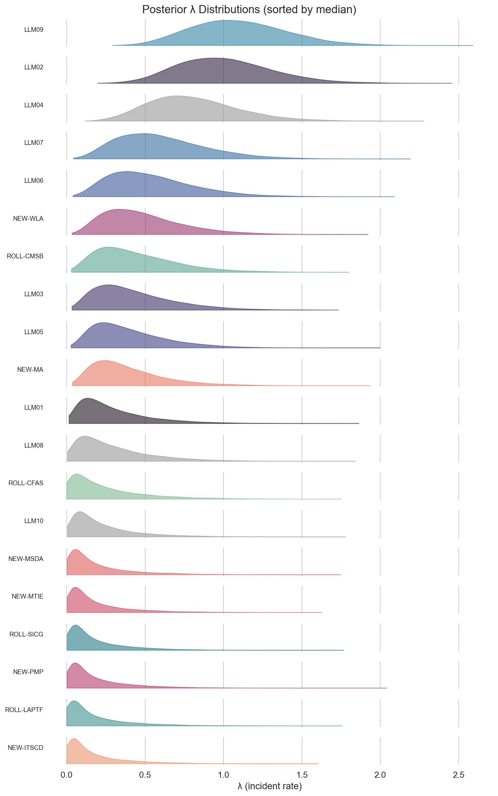

# Act 6: The Incident-Derived Rankings

These rankings reflect what the incident data suggests after correcting for classifier error. They are one signal, not the final word.

For each entry, the Bayesian model gives us a posterior distribution over its true incident rate. We rank entries by their median rate and report a 90% credible interval on the rank. Some entries have tight intervals (the data is informative) and others are wide (less certain). The width tells you how much to trust the rank position.

## How to read the chart

Each row is one taxonomy entry. The diamond marks the **median rank** — the rank position at the center of the posterior distribution. The horizontal bar spans the **90% credible interval** — the range of ranks that the model considers plausible given the data and its uncertainty about precision, recall, and the true incident rate.

**Tight intervals** (e.g., LLM02 spanning 1–6) mean the data strongly constrains that entry's position. Even after accounting for classifier error, the evidence points to a narrow range.

**Wide intervals** (e.g., spanning 6–20) mean the data is compatible with many rank positions. This happens when the entry has low precision (the correction is large and uncertain), few observations (small sample sizes produce wide posteriors), or unmeasured recall (the model uses a conservative prior that adds uncertainty).

**Grey entries** (LLM04, LLM08, LLM10) are frame-blind — their measurements come from only one stratum. Their positions carry structural uncertainty beyond what the CI captures.

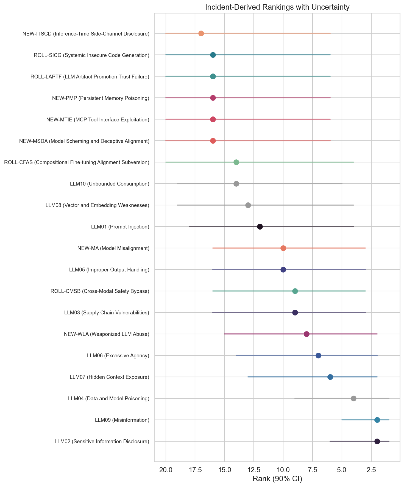

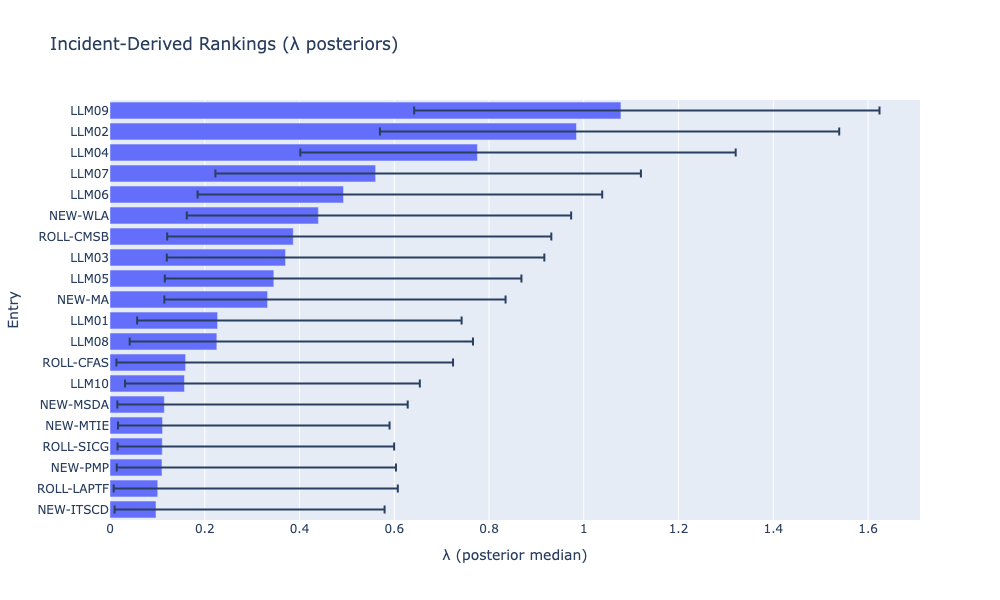

## Corpus B corroboration

Corpus B is an independent GenAI-agentic incident dataset of 46 records, of which 46 are shared with corpus A. Label agreement on the shared subset is 12/46 (26%). The agreement rate is modest, which is expected given the different sampling frames and labeling rubrics. We treat Corpus B as a cross-check on corpus A rather than as ground truth.

# Act 7: The Confrontation — Do Experts and Incidents Agree?

Cohen's weighted kappa measures agreement between two ranking systems, adjusted for chance. A value of 1.0 means perfect agreement. A value of 0 means no better than random. Negative values mean systematic disagreement.

**Our result: kappa = 0.2029 with a 95% credible interval of [-0.1594, 0.5652]** (interval method: paired_draw_percentile). This interval includes zero. We cannot exclude the possibility that expert and incident rankings agree by chance alone. The point estimate of 0.20 suggests slight agreement, but the wide interval means this is a weak signal, not a firm conclusion.

Why is the interval so wide? Two reasons. First, we only have 17 measurable entries (three are frame-blind). Statistical agreement measures need larger samples for narrow confidence intervals. Second, the posterior rank distributions themselves are wide — most entries have 90% CIs spanning 10+ rank positions.

**Selection bias check.** Kruskal-Wallis H = 0.5507, p = 0.4580. We cannot reject the null hypothesis that the incident-count distribution is the same across the vote-rank tiers, which is the result we want: no detectable selection bias in how incidents distribute against the expert vote.

**Probability of tier mismatch.** Across the full joint posterior, we compute for each entry the probability that the Bayesian model and the expert survey place it in different thirds of the ranking. Five entries exceed the 83% probability threshold τ:

5 entries flagged (P(tier mismatch) > τ):

- **LLM01**: P = 0.87, direction = vote_over_ranks
- **LLM09**: P = 0.99, direction = vote_under_ranks
- **NEW-MTIE**: P = 0.83, direction = vote_over_ranks
- **NEW-PMP**: P = 0.92, direction = vote_over_ranks
- **NEW-WLA**: P = 0.84, direction = vote_under_ranks

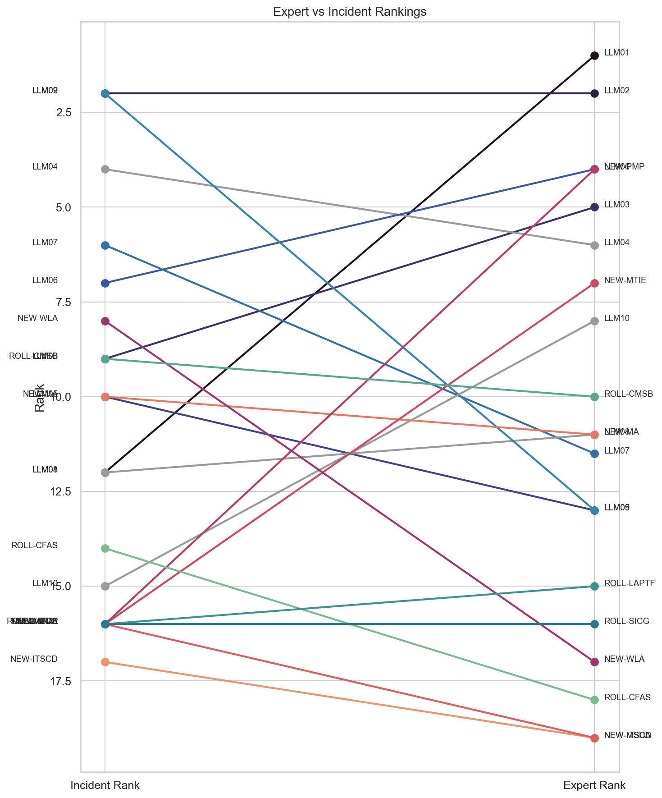

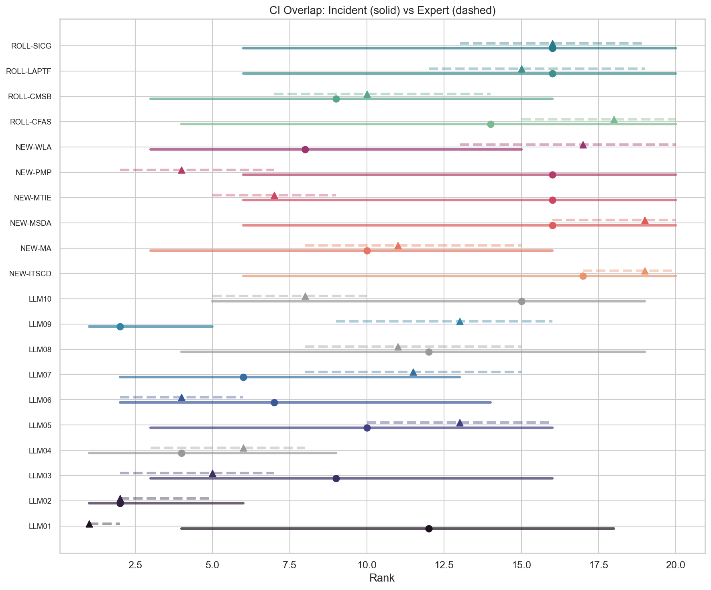

# Act 8: Where Experts and Incidents Disagree

Five entries have notable tier mismatches. For each, we dig into *why* the disagreement exists — what the data shows and what it might mean.

**LLM01 (Prompt Injection)**: Expert rank #1 (90% CI: 1–2), incident rank #12 (90% CI: 4–18). Prompt injection is the best-understood LLM attack. Deployed systems defend against it actively — input filtering, output sandboxing, system-prompt hardening. Fewer incidents reach public databases because defenses often work. Experts rank it #1 because the attack surface is enormous even when defenses hold. The incident data sees fewer successful exploits, so the model ranks it lower. This is a defense-effect artifact, not evidence that prompt injection is unimportant.

**LLM09 (Misinformation)**: Incident rank #2 (90% CI: 1–5), expert rank #13 (90% CI: 9–16). The corpus contains a large volume of deepfake and AI-generated disinformation incidents from the AIAAIC harm database. Experts may rank misinformation lower because "misinformation" as a category overlaps with other entries (NEW-WLA, ROLL-CMSB) and because many of these incidents describe harm *from* AI rather than a vulnerability *in* an LLM. We examine this overlap in §9B.

**NEW-PMP (Persistent Memory Poisoning)** and **NEW-MTIE (MCP Tool Interface Exploitation)**: Expert top-5, almost no incidents yet. These are emerging threats — persistent memory poisoning and MCP tool exploitation are new enough that the public incident record has not caught up. If the goal of the Top 10 is to warn practitioners about threats they will face, expert signal may matter more than incident counts for emerging entries. The incident ranking treats the absence of public reports as low prevalence, which is operationally wrong when the actual cause is reporting lag.

**NEW-WLA (Weaponized LLM Abuse)**: Incident rank #8 (90% CI: 3–15), expert rank #17 (90% CI: 13–20). The large incident count is driven by a broad entry definition that captures AI-generated disinformation, deepfake CSAM, and synthetic media abuse. Experts may rank it low because many of these incidents describe harm *from* AI systems rather than an exploitable vulnerability *in* an LLM. The category sits inside the confusion boundary discussed in §9B, which inflates its count at the expense of LLM09 and ROLL-CMSB.

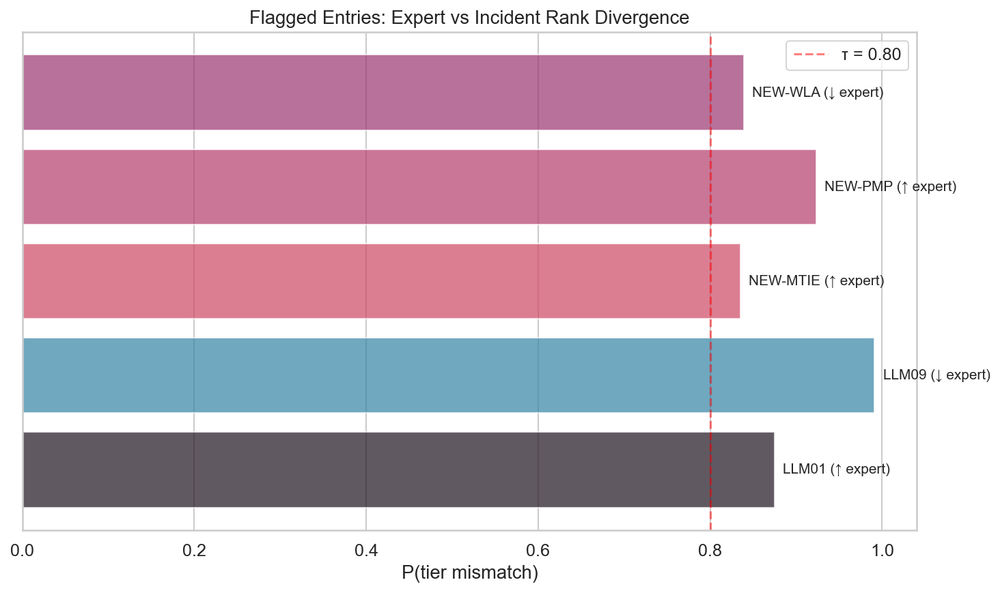

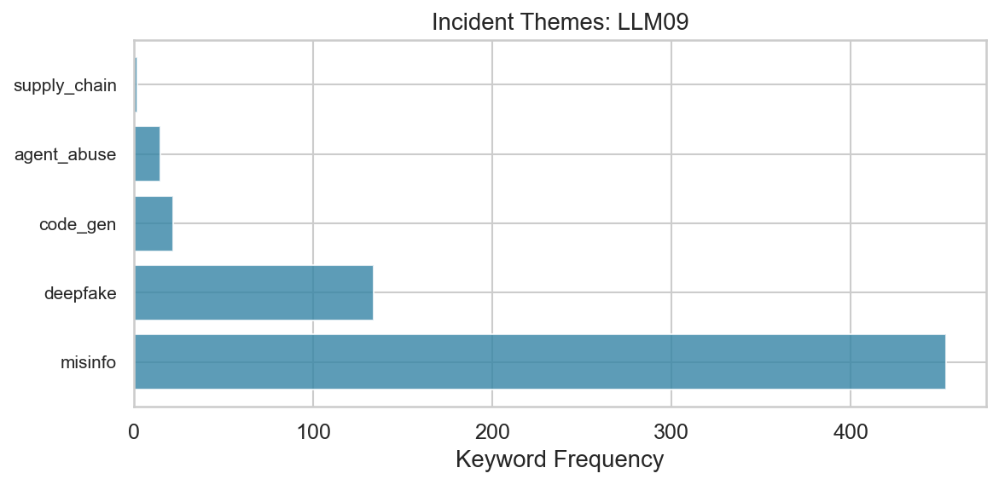

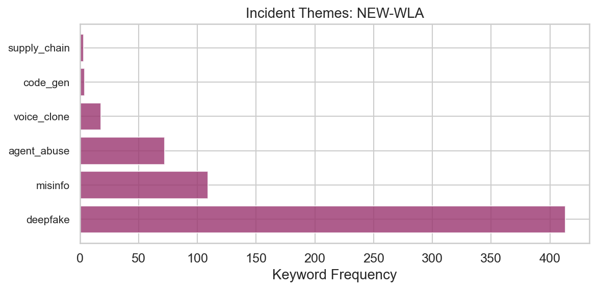

# Act 9: What the Data Cannot See

The ranking analysis covers the 17 measurable entries. But two patterns in the data reveal structural limits of what incident-counting can tell us.

## "AI Harm Without LLM Vulnerability"

Roughly 40% of the corpus — 2,394 incidents — landed in "out of scope." All three models agreed these do not belong to any of the 20 taxonomy entries.

These are real AI harms. Facial recognition that misidentifies people. Algorithmic hiring tools that discriminate. Drones used for surveillance. Recommendation engines that radicalize users. But none of them describe a vulnerability *in* a large language model. They are incidents *from* AI systems, not incidents *of* LLM vulnerabilities.

This gap is a feature of the sampling frame, not a failure of the taxonomy. The corpus was built by crawling CVE/GHSA/OSV databases with AI-related keywords. Those keywords pull in any incident that mentions "AI" or "machine learning," regardless of whether an LLM is involved. The AIAAIC harm database, by design, covers all AI-related harms.

The out-of-scope cluster matters because it shows the boundary of what this methodology can measure. Incident-counting works when incidents map to taxonomy entries. For harms that sit outside the taxonomy — because they involve non-LLM AI, or because they describe societal effects rather than technical vulnerabilities — the incident signal is silent. A future cycle could (a) tighten the sampling-frame keywords, (b) add a parallel taxonomy for AI-system harms outside LLM vulnerability, or (c) accept the silence and report it as a known scope limit. We do (c) in this cycle and recommend (b) for future work.

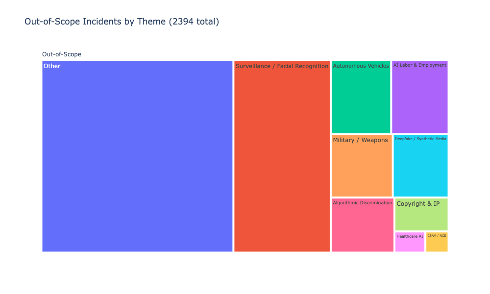

## The LLM09 / NEW-WLA / ROLL-CMSB confusion boundary

A **confusion boundary** is a region where categories overlap enough that classifiers — and sometimes humans — cannot reliably tell them apart. The problem is not that the classifier is broken. The problem is that the categories share real conceptual territory.

The data shows a clear confusion boundary between three entries:

- **LLM09 (Misinformation)**: the output is false or misleading
- **NEW-WLA (Weaponized LLM Abuse)**: an adversary uses AI as a weapon
- **ROLL-CMSB (Cross-Modal Safety Bypass)**: the attack uses image/video/audio modalities

Consider a deepfake video that spreads political disinformation. Which entry does it belong to? It is misleading content (LLM09). It was created using AI as a weapon (NEW-WLA). It exploits an image/video generation modality (ROLL-CMSB). The three categories overlap in real-world incidents, and the overlap is not a classification error — it reflects genuine ambiguity in the taxonomy.

This matters for interpretation. When the incident data ranks LLM09 at #2, some of that signal comes from incidents that could equally have been classified as NEW-WLA or ROLL-CMSB. The confusion boundary inflates counts for whichever entry the classifier happens to prefer and deflates counts for the others. The Bayesian model corrects for measured precision (how often each entry's classifications are right), but it cannot correct for ambiguity that the gold-set reviewers themselves found difficult to resolve. Resolving this would require either tighter entry definitions in the next rubric revision or an explicit modeling of label uncertainty for the three boundary entries; we recommend the former.

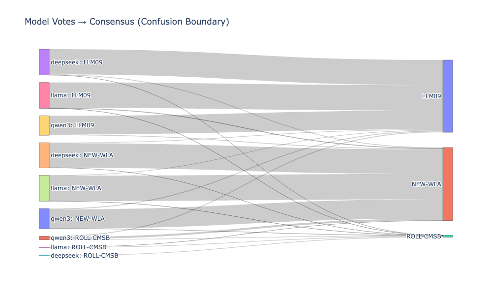

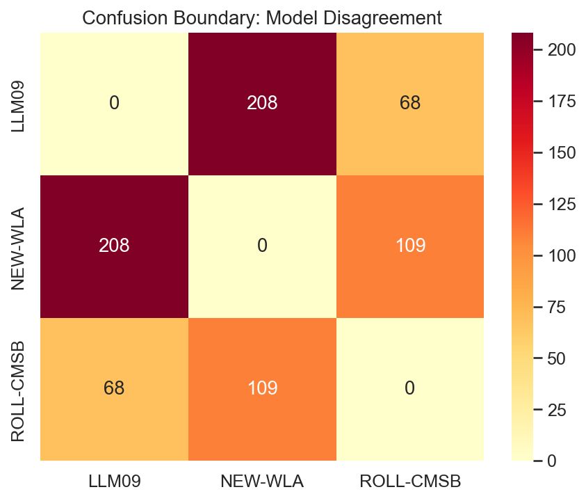

# Act 10: What This Means

**Where the data and experts agree.** LLM02 (Sensitive Information Disclosure) sits near the top by both measures — experts rank it #2 and incidents rank it #2. ROLL-SICG, NEW-ITSCD, and NEW-MSDA are consistently near the bottom by both signals. These positions are stable across the uncertainty ranges, which is the strongest form of convergent validation the methodology can produce.

**Where the data pushes back.** LLM09's incident volume is much higher than its expert rank. Part of this comes from the broad entry definition, which captures AI-adjacent harms (deepfake misuse, synthetic disinformation) that may not represent LLM vulnerabilities in the narrow sense. NEW-WLA shows a similar pattern. The confusion boundary between LLM09, NEW-WLA, and ROLL-CMSB inflates whichever entry the classifier prefers and makes all three counts less reliable than entries with cleaner boundaries.

**What the experts see that incidents miss.** NEW-PMP and NEW-MTIE have almost no incidents in the public record but strong expert signal. These are forward-looking entries — persistent memory poisoning and MCP tool exploitation are new enough that the incident databases have not caught up. If the purpose of the Top 10 is to warn practitioners about threats they will face, expert signal matters more than incident counts for emerging threats. We recommend treating these entries as expert-led for at least one more cycle.

**What this methodology can and cannot do.** This is a triangulation tool. It checks one signal (expert surveys) against another (incident data). Neither signal is the truth. The incident data has known structural biases: the sampling frame misses incidents that are not publicly reported, the classifier has measured error rates, and the taxonomy-frame circularity (F-circ) means we are partially measuring the classifier's preferences rather than the true threat distribution. The expert data has its own biases: availability bias, recency effects, anchoring to prior Top 10 lists.

The value is in the comparison, not in either signal alone. Where experts and incidents agree, confidence is higher. Where they diverge, the disagreement itself is the finding — it points to entries where one signal or the other may be systematically distorted.

**The kappa ceiling is structural.** Some of the disagreement between expert and incident rankings is informative — it reveals real differences between "what experts worry about" and "what has actually happened." Perfect agreement would be surprising and arguably suspicious. The current kappa of 0.20 [-0.16, 0.57] is consistent with weak-to-moderate agreement, but the confidence interval is too wide to draw firm conclusions. A larger corpus, better-defined entry boundaries, and independent recall measurement would all narrow the interval and sharpen the comparison.

# Threats to Validity

The threats register below is loaded programmatically from `engine/threats/register.py`. Each entry names a specific failure mode and the rationale for why it is either mitigated or accepted in this cycle. Future cycles should re-evaluate every accepted threat.

- **F1-ingestion-frame**: corpus sampling frame is blind to incidents that never become CVE/GHSA/OSV entries or harm-database rows
- **F2-default-seed-contamination**: CVE ingest seeds every entry with LLM03; bare-default labels are contamination
- **F3-classifier-blind-spots**: classifier is a heuristic with measured error, not a source of truth
- **F4-structural-blind-spots**: owasp_llm distribution reflects classifier ruleset, not threat landscape
- **F5-circular-atlas**: MITRE ATLAS labels are backfill from OWASP, not independent
- **F-frame**: corpus A built by CVE/GHSA/OSV keyword crawl; deployed-app failures outside these sources never enter the sampling base
- **F-circ**: taxonomy-frame circularity: measuring a taxonomy against incidents classified by that taxonomy
- **F-adversarial-ingestion**: public CVE/GHSA/OSV are open submission surfaces; descriptions are attacker-controlled; infer_attack_vector is pure regex
- **F-defenseindepth**: the engine has many integrity controls; this can create false confidence that all bugs are upstream of the engine when debugging unexpected results
- **F-aiharm-precision**: ai-harm stratum has no direct precision measurements; ai-harm precision keys are absent from posteriors.json entirely, so the model falls back to Beta(1,1) = Uniform(0,1) via the default initialization in inference.py (apply_empirical_precision_prior cannot reach keys that do not exist)

# Accepted Limitations

**Ai-harm precision (F-aiharm-precision).** The 323 precision verifications were drawn entirely from the security stratum. The ai-harm stratum (92 in-scope incidents across 8 entry assignments, of which only 3 received recall posteriors with material evidence — LLM09, LLM04, NEW-MA; NEW-WLA has only 1 observation above the pure prior) has no direct precision measurements — ai-harm precision keys are absent from the calibration data entirely. The model falls back to a flat Beta(1,1) = Uniform(0,1) prior for ai-harm precision, meaning it assumes no prior knowledge about how precise the classifier is on ai-harm incidents (prior mean 0.5). Closing this gap would require sourcing additional ai-harm incidents beyond the existing corpus, which is outside this project's scope. The disclosure in §4 and §5 describes how the model handles missing precision data.

**Frame-blind entries (F1-ingestion-frame).** LLM04, LLM08, and LLM10 have incident counts that come entirely from one stratum, preventing cross-stratum recall estimation. Their ranks in §6 carry structural uncertainty beyond what the credible intervals capture. We mark them with ★ in the charts and treat their rank positions as advisory rather than authoritative.

**Taxonomy-frame circularity (F-circ).** We are measuring a taxonomy against incidents classified by that taxonomy. The classifier's preferences inflate entries it picks readily and deflate entries it picks rarely. The Bayesian error-correction layer addresses this only to the extent that precision and recall are well-measured — for low-precision entries (§4.1) the correction itself carries large uncertainty.

**Single-author rubric.** The 2026 rubric was authored by a single hand. Independent rubric review and dual-coded gold sets are required before any external publication of these results. The non-publishable banner at the top of this document reflects that constraint.

# Reproducibility

Every figure and statistic in this document is regenerated from the cycle directory `projects/owasp-llm/cycles/2026/`. Re-run via:

```
python -m engine.cli report-narrative \
    --cycle-dir projects/owasp-llm/cycles/2026 \
    --output-dir notebooks/narrative
```

Output filenames: `2026_top_10_llm_update_what_the_data_says.md` (this file) and `2026_top_10_llm_update_what_the_data_says.pdf` (PDF compiled by pandoc with the xelatex engine). All figures land in `notebooks/narrative/figures/`. The corresponding Jupyter notebook is `notebooks/2026_top_10_llm_update_what_the_data_says.ipynb`; the prose in this report is congruent with the notebook narrative cell by cell, with added section numbering and an abstract for arXiv-style distribution.

**Data provenance.** Cycle artifacts are content-hashed at `projects/owasp-llm/cycles/2026/snapshot/`. Hyperparameters and seeds are hash-locked in `prereg/manifest.json`. The MCMC sampler is pinned to CPU for cross-platform determinism (NumPyro + JAX). Posterior draws are stored as `infer/lambda_samples.npy` and the convergence diagnostics in `infer/inference_summary.json`.

