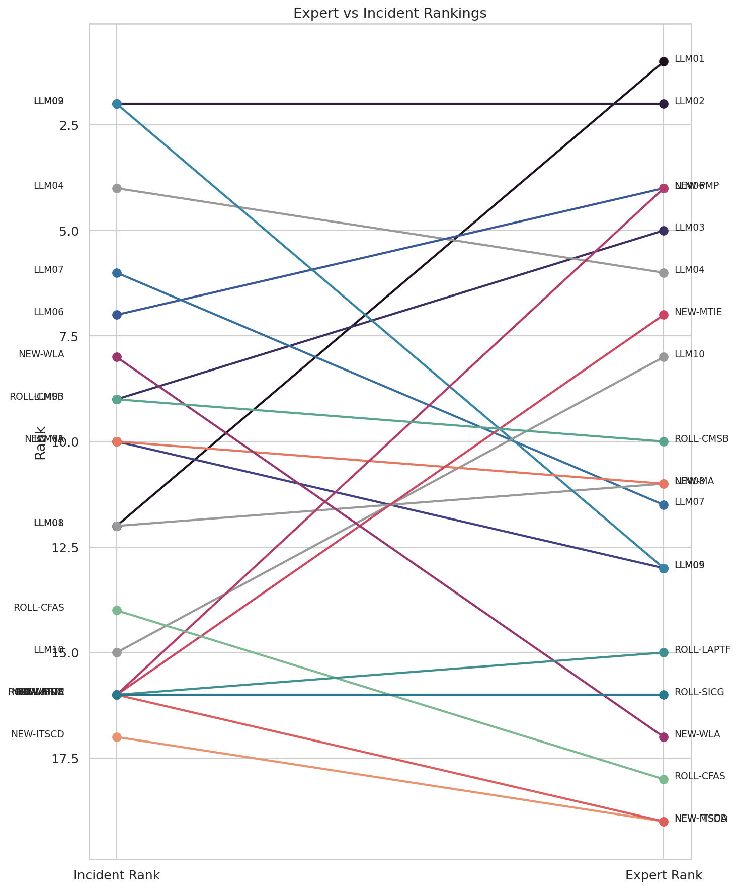

## Introduction

This is a stub document used to validate the arXiv LaTeX build pipeline.
It exercises the author/affiliation block, figure inclusion at 85% width, running header, and table of contents before any real content is authored.

{width=85%}
